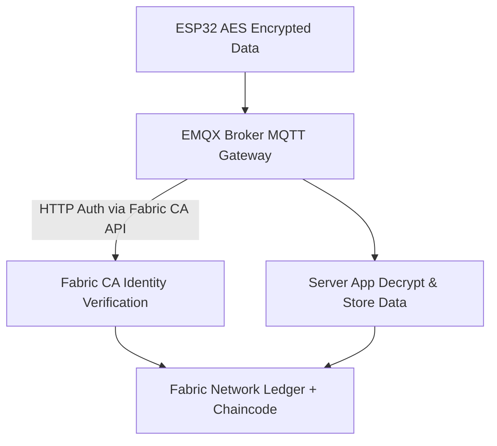

# 🌐 Fabric-EMQX-IoT-Gateway  
> Secure IoT Device Authentication & Data Transmission using **Hyperledger Fabric CA** + **EMQX Broker** + **AES Encryption**

[](https://github.com/IoT-Security-Using-Blockchain/Fabric-EMQX-IoT-Gateway/stargazers)
[](https://github.com/IoT-Security-Using-Blockchain/Fabric-EMQX-IoT-Gateway/issues)
[](https://github.com/IoT-Security-Using-Blockchain/Fabric-EMQX-IoT-Gateway/commits/main)
[](LICENSE)

---


This project demonstrates a **secure IoT data pipeline** where ESP32 devices send **AES-encrypted health data** through an **EMQX MQTT broker**, which authenticates devices against **Hyperledger Fabric CA identities**.  

It ensures that **only registered Fabric devices** can connect and publish data, making it suitable for **healthcare, supply chain, or critical IoT applications**.  

---

## 📂 Project Structure
```markdown
Fabric-EMQX-IoT-Gateway/
│── esp32/                     # ESP32 source code
│   ├── main.ino                # MQTT + AES encryption code
│   ├── README.md                
│
│── node-cli/                  # Node.js CLI for Fabric CA
│   ├── registerDevice.js       # Register device & add to wallet
│   ├── server.js       # Run the server to add data to Ledger
│   ├── admin.id        # if other than admin other registered will be listed here
    ├── README.md
│
│── README.md                  # 📌 Project readme
│── LICENSE
```

## 🌟 Features
- ✅ **ESP32 integration** with heart-rate & SpO2 sensor.  
- 🔐 **AES encryption** on device payloads.  
- 🪪 **Device identity management** using Hyperledger Fabric CA.  
- 📡 **EMQX authentication** via Fabric CA (API-based).  
- 🗂 **Device registration CLI tool** for onboarding new devices.  
- 📊 Health data format: `assetID`, `deviceId`, `spo2`, `heartRate`.  
- 🔄 Secure end-to-end flow (ESP32 → EMQX → Fabric → Server).  

---

## 🏗 System Architecture


## ⚡ Prerequisites
- [Fabric Network Setup](https://github.com/IoT-Security-Using-Blockchain/Secure-IoMT-Edge-Data-via-Hyperledger-Fabric)  
  (Follow this repo for starting the Fabric CA and network)  
- EMQX 5.10+ installed (Enterprise or Open Source).  
- Node.js for the device registration CLI.  
- ESP32 board with sensors (SpO2, HR).  

---

## 🔑 Device Registration Workflow
We provide a **Node.js CLI tool** to register new IoT devices:  

```bash
# Register a device identity in Fabric CA and store it in the wallet
$ node manageDevice.js
```
> This creates a Fabric identity and allows EMQX to authenticate the ESP32 using its username and password given as a mqtt id and password.

### Output:
```markdown
Enrolling admin (will overwrite if exists)... ?
Admin enrolled and overwritten in wallet
? Choose an action: (Use arrow keys)
> Register/Enroll Device
List Enrolled Devices
Exit
```

## 📡 ESP32 Payload Format

Each ESP32 sends data in the following structure:
```json
{
  "assetId": "asset-12345",
  "deviceId": "B4:E6:2D:34:AB:12",
  "spo2": 95,
  "heartRate": 102
}
```

- assetId → unique per reading (generated by ESP32).
- deviceId → ESP32 MAC address.
- spo2/heartRate → live sensor values.

> Payload is AES-encrypted before transmission and decrypted on the server side.


## ⚙️ EMQX Authentication Setup
1. Go to Authentication tab in EMQX dashboard.
2. Choose HTTP Server as backend.
3. Configure authentication request body:
    ```json
    {
    "username": "${username}",
    "password": "${password}"
    }
    ```
4. Point the URL to your Fabric CA verification API.


## 🚀 How to Run
- Start the Fabric Network → [Setup Guide](https://github.com/IoT-Security-Using-Blockchain/Secure-IoMT-Edge-Data-via-Hyperledger-Fabric)

- Run EMQX broker with HTTP authentication.

- Register devices via CLI (registerDevice.js).

- Flash ESP32 code (AES encryption enabled).

- Start the server to decrypt and process incoming data.
    ```bash
    node server.js              //To start the server
    ```


## 📌 Example Workflow
1. Register ESP32 identity in Fabric CA.

2. ESP32 connects to EMQX with ID + password.

3. EMQX calls Fabric CA API → verifies identity.

4. ESP32 sends AES-encrypted health data.

5. Server decrypts and processes data.


## 🔮 Future Enhancements

>- Add end-to-end ASCON lightweight encryption.

>- Deploy Grafana dashboards for real-time health monitoring.

>- Extend support for multiple IoT device types.


## 🎯 Use Cases

>- 🏥 Healthcare IoT Security (SPO2/Heart Monitoring)

>- 🏭 Industrial IoT with Blockchain trust

>- 🔐 Secure MQTT IoT Gateway


## 📝 License
***This project is licensed under the Apache License 2.0 - see the [LICENSE](LICENSE) file for details.***